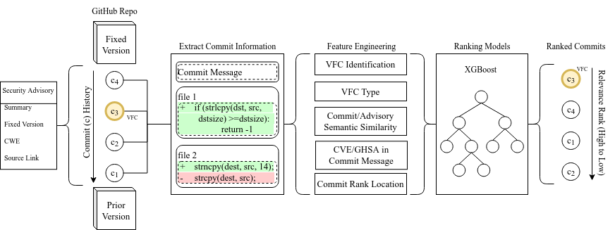

<h1 align="center">
VFCFinder
</h1>

<!-- <p align="center">
  This repository contains the <strong>VFCFinder</strong> source code.
  VFCFinder is a Python library developed to find the associated patch links for a given security advisory.
</p> -->

<p align="center">
<a href="#introduction">Introduction</a> &nbsp;&bull;&nbsp;
<a href="#installation">Installation</a> &nbsp;&bull;&nbsp;
<a href="#usage">Usage</a> &nbsp;&bull;&nbsp;
<a href="#license">License</a> &nbsp;&bull;&nbsp;
<a href="#contact">Contact</a>
</p>

# Introduction
Vulnerability fixing commits (VFC) play a critical part in the health of modern-day software: they are used by practitioners to triage vulnerabilities and by academic researchers to enable novel tools for enhancing the security of the software supply chain. Unfortunately, the majority of reports in existing vulnerability databases are missing VFCs.

<b>VFCFinder</b> helps find those missing VFCs. Given a security advisory, VFCFinder produces a set of ranked commits related to fixing that given security advisory:

<p align="center">
<!--  -->

</p>
 

# Installation
Clone the VFCFinder repository and pip install from the clone. We recommend creating a [virtual environment](https://docs.python.org/3/library/venv.html) to install VFCFinder. 

```shell
git clone git@github.com:s3c2/vfcfinder.git
cd vfcfinder

python3 -m venv .venv
source .venv/bin/activate
pip3 install .
```

VFCFinder will be on PyPI soon! 

## Requirements

Currently, VFCFinder has only been tested on Linux (Ubuntu 22.04) and with Python 3.10. 
VFCFinder does not require a GPU, but if you have a [CUDA-capable](https://docs.nvidia.com/cuda/cuda-installation-guide-linux/index.html) GPU it will automatically use the GPU over the CPU to increase performance.

# Usage

Currently, security advisories must be on your local system. Users can download advisories from [GitHub Advisory Database](https://github.com/github/advisory-database) or [OSV Vulnerability Database](https://osv.dev/). 
VFCFinder has a set of minimum requirements for the security advisory:
  * Must be in the [Open Source Vulnerability (OSV)](https://ossf.github.io/osv-schema/) format
    * Example: [GHSA-v65g-f3cj-fjp4](https://github.com/github/advisory-database/blob/main/advisories/github-reviewed/2022/08/GHSA-v65g-f3cj-fjp4/GHSA-v65g-f3cj-fjp4.json)
  * Contains a [ranges fixed version](https://ossf.github.io/osv-schema/#affectedrangestype-field)
    * Example: ```"fixed": "0.5.9"```
  * Has a labeled [database specific](https://ossf.github.io/osv-schema/#affecteddatabase_specific-field) CWE-ID type
    * Example: ```"cwe_ids": ["CWE-1333", "CWE-697"]```
  * Contains a GIT package source code link in the [references](https://ossf.github.io/osv-schema/#affecteddatabase_specific-field)
    * Example: ```{"type": "PACKAGE", "url": "https://github.com/ethereum/eth-account"}```

## Use VFCFinder as a command line tool:
```shell
vfcfinder -h

usage: vfcfinder [-h] --advisory_path ADVISORY_PATH --clone_path CLONE_PATH [--output_path OUTPUT_PATH]

VFCFinder - matches commits to a security advisory.

options:
  -h, --help            show this help message and exit
  --output_path OUTPUT_PATH
                        Path to save output to a CSV

required arguments:
  --advisory_path ADVISORY_PATH
                        Local path to the target OSV security advisory
  --clone_path CLONE_PATH
                        Local path to clone the GitHub Repository

More info: https://github.com/s3c2/vfcfinder
```

The below example is downloading an initial advisory to scan, creating the clone path for downloading repositories from the targeted advisory, and running VFCFinder from the command line:
```shell
~/demo$ tree -L 1
.

0 directories, 0 files

# download a GHSA sample file
~/demo$ curl https://raw.githubusercontent.com/github/advisory-database/main/advisories/github-reviewed/2022/08/GHSA-v65g-f3cj-fjp4/GHSA-v65g-f3cj-fjp4.json -o GHSA-v65g-f3cj-fjp4.json

# Create a directory to store the clones
~/demo$ mkdir ./clones/

~/demo$ tree -L 2
.
├── clones
└── GHSA-v65g-f3cj-fjp4.json

1 directory, 1 file

# run VFCFinder by pointing to the local GHSA file and the clone path
~/demo$ vfcfinder --advisory_path ./GHSA-v65g-f3cj-fjp4.json --clone_path ./clones/ --output_path ./ranked_commits_GHSA-v65g-f3cj-fjp4.csv

Cloning repository: ethereum/eth-account
Cloning repo to: ./clones/ethereum/eth-account
Obtaining diff for commit 1/5 || c0060ca
Obtaining diff for commit 2/5 || da84e6d
Obtaining diff for commit 3/5 || 891ec7c
Obtaining diff for commit 4/5 || f1ee532
Obtaining diff for commit 5/5 || 70f89be

Generating VFC probability inference for each commit...
100%|████████████████████| 1/1 [00:00<00:00,  1.30it/s]

Generating VFC type inference for each commit...
100%|████████████████████| 1/1 [00:01<00:00,  1.02s/it]


Generating semantic similarity scores: 1/5 || c0060ca
Generating semantic similarity scores: 2/5 || da84e6d
Generating semantic similarity scores: 3/5 || 891ec7c
Generating semantic similarity scores: 4/5 || f1ee532
Generating semantic similarity scores: 5/5 || 70f89be

Ranked commits in relevance to advisory ./GHSA-v65g-f3cj-fjp4.json:
Rank 1 ||  SHA: 70f89be ||  Commit Message: fix redos-able regex and add poc code to || VFC Prob: 0.02
Rank 2 ||  SHA: f1ee532 ||  Commit Message: Update mypy version (#183) || VFC Prob: 0.01
Rank 3 ||  SHA: 891ec7c ||  Commit Message: Allow bumpversion to find version (#184) || VFC Prob: 0.0
Rank 4 ||  SHA: c0060ca ||  Commit Message: Bump version: 0.5.8 → 0.5.9 || VFC Prob: 0.0
Rank 5 ||  SHA: da84e6d ||  Commit Message: Compile release notes || VFC Prob: 0.0

# we can see the repository of the target advisory was cloned and output was saved from VFCFinder
~/demo$ tree -L 3
.
├── clones 
│   └── ethereum # cloned repository initiated by VFCFinder
│       └── eth-account
├── GHSA-v65g-f3cj-fjp4.json
└── ranked_commits_GHSA-v65g-f3cj-fjp4.csv  # saved output from VFCFinder

3 directories, 2 files
```


## Use VFCFinder as a library:
```python
import vfcfinder

if __name__ == '__main__':
    # Set required args for VFCFinder
    ADVISORY_PATH = "./GHSA-v65g-f3cj-fjp4.json" # local path to the advisory
    CLONE_PATH = "./clones/" # clone path can be any location
 
    # Rank the commits in relevance to a GHSA report. 
    # Returns a pd.DataFrame, without saving the results
    ranked_commits = vfcfinder.vfc_ranker.rank(clone_path=CLONE_PATH,
                                               advisory_path=ADVISORY_PATH,
                                               return_results=True)

    # print the top ranked commit
    print(f"Matching commit = {ranked_commits.iloc[0].sha}")
```

Expected output:
```
Obtaining diff for commit 1/5 || c0060ca25e8461b9622eab318d922c0a48e8d5a8
Obtaining diff for commit 2/5 || da84e6db056f77632d5ff5a5ec7c3fb04e488586
Obtaining diff for commit 3/5 || 891ec7cfa2351433a44e13924361380136c2cd6a
Obtaining diff for commit 4/5 || f1ee53297593fde87b223e7176009baff11b6735
Obtaining diff for commit 5/5 || 70f89be700df0d5f08ef696252c88741f8414060

Generating VFC probability inference for each commit...
100%|█████████████| 1/1 [00:03<00:00,  3.37s/it]

Generating VFC type inference for each commit...
100%|█████████████| 1/1 [00:03<00:00,  3.63s/it]

...

Matching commit = 70f89be700df0d5f08ef696252c88741f8414060
```


## Identifying VFCs:
```python
import vfcfinder

if __name__ == '__main__':
    # Set args 
    # Example: https://github.com/advisories/GHSA-4fc4-4p5g-6w89
    REPO_OWNER = "ckeditor"
    REPO_NAME = "ckeditor4"
    TARGET_SHAS = ["d158413449692d920a778503502dcb22881bc949"]
    CLONE_PATH = "./clones/" # clone path can be any location
    full_repo_path = f"{CLONE_PATH}{REPO_OWNER}/{REPO_NAME}/"

    # clone the repository
    vfcfinder.utils.git_helper.clone_repo(
        repo_owner=REPO_OWNER, 
        repo_name=REPO_NAME, 
        clone_path=CLONE_PATH
    )

    # generate the VFC probability
    probs = vfcfinder.vfc_identifier.vfc_prob(clone_path=full_repo_path,
                                              commits=TARGET_SHAS)
    
    # print the VFC probability
    print(probs.head())
```

Expected output:
```
Obtaining diff for commit 1/1 || d158413449692d920a778503502dcb22881bc949

Generating VFC probability inference for each commit...
100%|   ██████████████████| 1/1 [00:03<00:00,  3.62s/it]

                                        sha  vfc_prob
0  d158413449692d920a778503502dcb22881bc949  0.991067
```

# Overview

At a high level, VFCFinder takes as input a security advisory and then uses AI/ML techniques to find the associated fixing commit. Our key approach is to take the set of commits between the fixed version and the version prior to the fix and use the combination of five intuitive features to produce a ranked set of potential VFCs for a given advisory. These features are:

- *VFC Identification*: fine-tuned [CodeBERT](https://github.com/microsoft/CodeBERT) model to predict how likely a commit fixed a vulnerability
- *VFC Type*: fine-tuned [CodeBERT](https://github.com/microsoft/CodeBERT) model to predict the type of vulnerability fixed
- *Commit/Advisory Semantic Similarity*: Uses [SentenceTransformers](https://www.sbert.net/) to generate a similarity score between the commit message and the advisory description
- *CVE/GHSA in Commit Message*: boolean match if the CVE/GHSA-ID is in the commit
message
- *Commit Rank Location*: normalized commit rank location of a commit in the version lifecycle

These features are then fed into a tuned XGBoost model to rank the commits relevant to fixing the given security advisory. The overall pipeline can be seen below:

<p align="center">
  
</p>


# License
VFCFinder is available under the Apache-2.0 License

  * ***Apache-2.0 License***: See [LICENSE](./LICENSE) file for details.

# Contact
For VFCFinder bug reports and feature requests please visit [GitHub Issues](https://github.com/s3c2/vfcfinder/issues).

# Authors
* [Trevor Dunlap](https://github.com/tdunlap607) 
* [Elizabeth Lin](https://github.com/elizabethtl)
* [William Enck](https://github.com/enck)
* [Brad Reaves](https://github.com/bradreaves)

